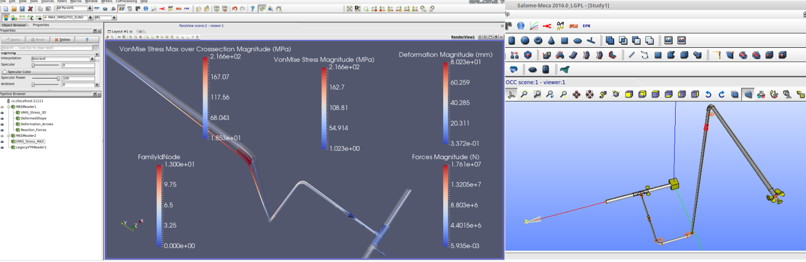

# TUBA - Piping Script to be used with Salome-Meca

[]

TUBA is a Python module orginally created by Pascal KREZEL and now developped by Jan-Georg WAGENFELD. It allows to create and simulate piping- and rod geometries in Salome-Meca (OpenSource under LPGL license).

With a simple to use set of commands even complex piping-geometries can be generated and different load cases can be simulated.
TUBA prepares the scripts for SalomeMeca, CodeAster and ParaVis which then have to be loaded into Salome-Meca where the actual simulation is effected.

Even without further knowledge of SalomeMeca, TUBA allows to quickly and easily create piping-geometries and effect the targeted calculation and analysis.

Check http://tuba-v2.readthedocs.io/en/sm2017/ for more informatios (SalomeMeca2017)
