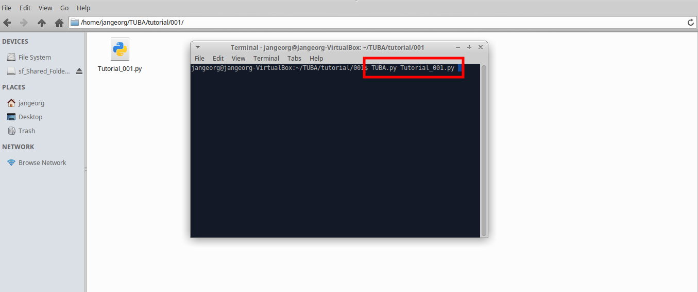
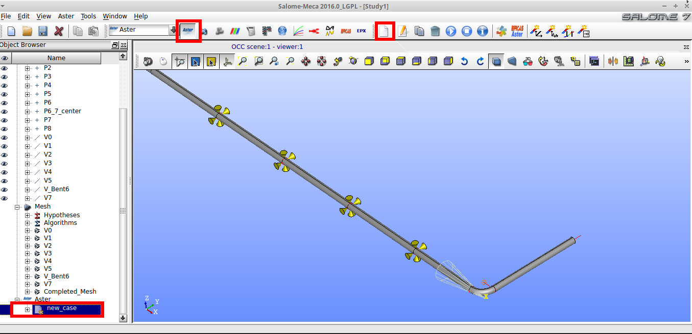
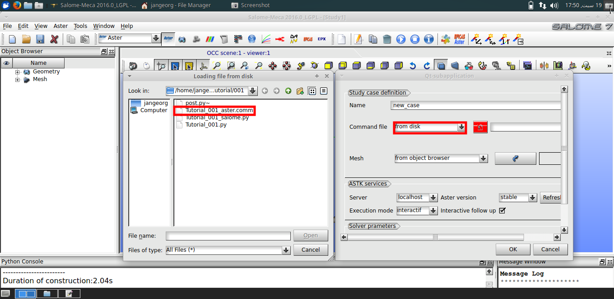

.. _my-reference-label:
How to start
==============

Assuming you followed the installation steps in the last chapter (`Installation`_), you can now run TUBA in your terminal with
the bash-command::

$ TUBA.py  command_script.py

The command_script as argument is your list of commands defining your geometry, your simulation and output. Executing TUBA will trigger the following actions:

#. generating a 3D-Plot of your defined geometry. The purpose of this plot is to get an immediate visualization of your geometry. 
   If needed, then your command list can be adapted before you start the import into Salome-Meca.

#. generating ``command_script_salome.py`` which then has to be loaded into Salome (in the Menu bar: ``File`` - ``Load Script...``)

#. generating ``command_script_aster.comm`` which then has to be loaded into the Code Aster Module. The file defines the simulation in Code Aster. Find more informations concerning the structure of comm-files under :ref:code_aster

#. generating ``command_script_post.py`` which then has to be loaded after a successful simulation. This file will start the post processing tool ParaVis and effect some standard plots. It is possible to adapt these plots or add new ones later on.
	

Writing the command script
---------------------------------

As mentioned above, the command-script consists of a list of commands defining your piping-geometry (or other rod-structure), it's properties(cross section, material, external and internal loads, etc) and finally also the simulation and post-processing.

It can be edited with any kind of text editor. An IDE with auto completion and auto help like Spyder(included in the Anaconda package) can be very helpful in the beginning, especially if you're not so familiar with the available commands.

The following code is a basic command script showing the most important commands - for a complete list of available commands, check - include hyper link. 

::

    #---UnitCalculator to use different input units---
    from external.UnitCalculator import *
    auto_converter(mmNS)

    outerRadius=35
    WallThickness=4
    
    Model("TUYAU")
    SectionTube(outerRadius,WallThickness)

    Material("SS304")
    Temperature(550,T_ref=20)
    Pressure(2*bar())

    P(0,0,0) 
    FixPoint()  

    V(1000,0,0)

    for i in range(0,4):	
    	Vc(1000)
    	Block(z=0)

    Vc(1000)
    Bent(150,90,0)
    
    Vc(1000)
    Block(y=-1000)

    Calculate("Statique_Linear")

Decomposing step by step:
--------------------------
To better understand, how TUBA works, we will decompose the upper script step by step and explaining the functionality.
::

    #---UnitCalculator to use different input units---
    from external.UnitCalculator import *
    auto_converter(mmNS)

`UnitCalculator <https://github.com/maldun/UnitCalculator>`_ is an external python module written by Stefan Reiterer to translate different units.

SalomeMeca does not have a fixed default unit system. The user can choose whatever system is preferred - as long as it is consistent. In the `Unit Table <http://caelinux.org/wiki/downloads/docs/PCarrico/CAELINUX_plasticite/CAELINUX_plasticite.html#SECTION000180000000000000000>`_ you can see different consistent unit systems.

Unit Calculator facilitate the use of different, sometimes more intuitive units like bar. The TUBA script was only tested with the mmNS metric system as base (``auto_converter(mmNS)``), therefore it is advisable to stay in this system. 
The base defines the internal unit system and therefore as well the units of the result. 

See the documentation of `UnitCalculator <https://github.com/maldun/UnitCalculator>`_ for more informations how to use the calculator and what conversions are available.

::

    outerRadius=35
    WallThickness=4

The command script is pure python code. Therefore variable declaration,loops, if-statements etc. can be used as usual.

::

    Model("TUYAU")
    SectionTube(outerRadius,WallThickness)

    Material("SS304")
    Temperature(550,T_ref=20)
    Pressure(2*bar())

Tuba has two major groups of commands - one defining the geometry, one the properties of the geometry. 
The property group splits further down in global and local properties. Their biggest difference is how they will be applied.
The upper code section defines the global properties of the following piping system. This means, all these properties listed above will be applied to all the following defined vectors/pipe segments until the command list ends or the specific property (like Tempererature or Pressure) will be set to another value.

As a consequence, before defining a geometry, essential global properties like ``Model("TUYAU")`` and ``SectionTube(outerRadius,WallThickness)`` have to be set before the first vector is defined.

::

    P(0,0,0) 
    FixPoint()
    V(1000,0,0)  

Local properties on the other side are just applied to the last created geometry object. In the upper case, a point with ``P(0,0,0)`` is created. Then the degrees of freedom of this Point are limited by using the macro command  ``FixPoint()``. FixPoint calls the local property command ``Block(x=0,y=0, z=0, rx=0, ry=0, rz=0)`` and therefore blocking all degrees of freedom.

``V(1000,0,0)`` creates a vector in the specified direction. To this vector the beforehand defined properties are applied.

::

    for i in range(0,4):	
    	Vc(1000)
    	Block(z=0)

    Vc(1000)
    Bent(150,90,0)
    
    Vc(1000)
    Block(y=-1000)

As mentioned above, for-loops can be used as usual. Be aware that the range statement goes up to 4, but not including this number. 

``Vc(1000)`` is another command to create a vector object, more specific a colinear vector to the last created one. Every vector command always creates a point at the end. To this point the local property ``Block(z=0)`` then will be applied.

``Bent(150,90,0)`` creates a 90degree bent with a 150mm (we are in mmNS) bent radius. Find more about this function 

A nonzero input in ``Block(y=-1000)`` represents an imposed displacement, in this case -1000mm in the y-direction.

::

    Calculate("Statique_Linear")

In this section, the simulation is defined. For now, it is limited to a linear static simulation. In the future, there will be more options available.

Run the simulation:
---------------------------------
With the finished script, run TUBA.py in the terminal (directory where the script is located).

After a succesful run, the created salome, aster and postprocessing scripts should be in the folder. Furthermore you will have the 3D plot as fast visualization.

.. figure::  _static/2_TUBAOutput.png
   :align:   center

Start SalomeMeca and create a new project file - if you already have an open SalomeMeca project, use ``Ctrl`` + ``N`` as shortkey to reset. Then load the ``command_script_salome.py`` file.

.. figure::  _static/3_ReadSalomeScript.png
   :align:   center

After the script has finished succesfully, you will see the created geometry and mesh in the object browser. You can control these results by starting the geometry and mesh module respectively. Keep in mind, that the geometry module just creates a 3D visualization of an 1D mesh. 
This doesn't apply in cases you actually define a 3D-model (see documentation).

As a next step, open the Aster module and ``Add study case``.  file. 

Load from disk the created ``command_script_aster.comm``. 

The mesh has to be choosen from the object browser to the left. Select the compound mesh  ``Completed_Mesh`` and confirm.
You can then select the now created Code Aster case and start the simulation. A terminal will open showing the ongoing simulation.

.. figure::  _static/6_LoadingMesh.png
   :align:   center

After the simulation finishes, you will most likely get an 'Alarm'-message - which can be ignored. If the simulation failed, check your python script again if everything was defined correctly. If you are familiar with Code Aster, you can check the ``.mess`` and ``.resu`` files for more information.

Your simulation results are written into an ``.rmed`` file. 

Analyse the results in ParaVis:
---------------------------------

To analyse, open the ParaVis module. Load the ``command_script_post.py`` file and choose the respective ``.rmed`` file.
A set of graphs will be plotted as a first point for further exploration.

.. figure::  _static/7_ParaVisOutput.png
   :align:   center

.. sidebar:: Sidebar Title
        :subtitle: Optional Sidebar Subtitle

   Subsequent indented lines comprise
   the body of the sidebar, and are
   interpreted as body elements.

